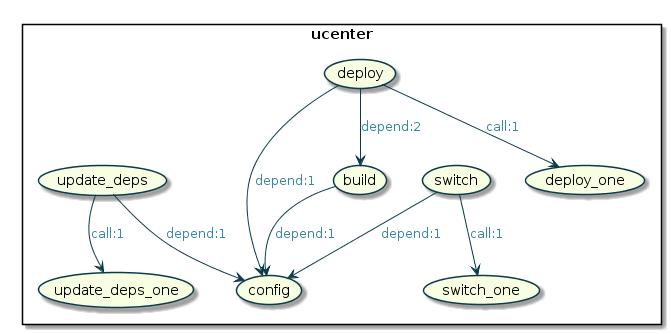
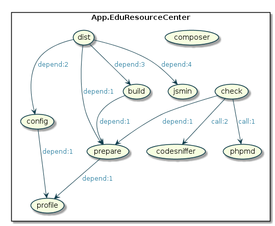
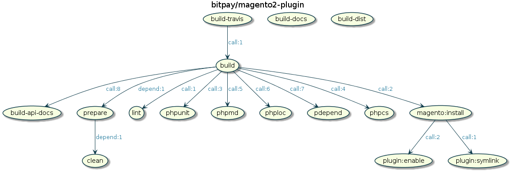

Phing visualizer
================

**Phing visualizer** generates a graphical representation of your 
[Phing](https://www.phing.info/)'s buildfile.

[](https://packagist.org/packages/jawira/phing-visualizer)
[](https://packagist.org/packages/jawira/phing-visualizer)
[](https://packagist.org/packages/jawira/phing-visualizer)
[](https://github.com/php-pds/skeleton)
[](https://codeclimate.com/github/jawira/phing-visualizer/maintainability)
[](https://codeclimate.com/github/jawira/phing-visualizer/test_coverage)
[](https://www.travis-ci.org/jawira/phing-visualizer)

You can go from this:

```xml
<?xml version="1.0" encoding="UTF-8"?>
<project name="My Phing's buildfile" default="test">

    <target name="test" depends="test:phpunit, test:composer">
        <phingcall target="test:notify"/>
    </target>

    <target name="test:composer">
        <composer>
            <arg line="validate --strict --no-check-lock"/>
        </composer>
    </target>

    <target name="test:phpunit">
        <exec executable="${phpunit}"/>
        <phingcall target="test:clean"/>
    </target>

    <target name="test:notify">
        <notifysend msg="Everything is OK!"/>
    </target>

    <target name="test:clean">
        <delete dir="${dir.output}" verbose="true"/>
    </target>

    <target name="diagnostics">
        <diagnostics/>
    </target>

</project>
```

To this:


**Phing visualizer** is able to represent:

- Target's depends
- RunTargetTask
- PhingCallTask
- ForeachTask

Usage
-----

You can use `phing-visualizer` in two possible ways:

### Using command line

Create your diagram using the command line:

```bash
$ vendor/bin/phing-visualizer
```

```bash
$ vendor/bin/phing-visualizer -i build.xml -f svg
```

```bash
$ vendor/bin/phing-visualizer --input /my/location/build.xml --format svg
```

```bash
$ vendor/bin/phing-visualizer -i /my/location/build.xml -f png  -o /another/location/ 
```

Executable options:

| Option                | Description                               | Required          | Default           |
| --------------------- | ----------------------------------------- | ----------------- | ----------------- | 
| `-i` or `--input`     | Phing's buildfile location                | No                | build.xml         |
| `-f` or `--format`    | Diagram format (`png`, `svg` or `puml`)   | No                | png               |
| `-o` or `--output`    | Dir or file location                      | No                | Same as `--input` |
| `-h` or `--help`      | Help                                      | No                |                   |

### Instantiating `Diagram` class

You can instantiate `Diagram` class to generate diagram in your source code:

```php
<?php
include 'vendor/autoload.php';

$intput = '/my/location/buildfile.xml'; // Input buildfile
$output = '/my/location/';              // Can be a dir or a file location
$format = 'png';                        // png, svg or puml

$diagram = new Jawira\PhingVisualiser\Diagram($input);
$diagram->save($format, $output);
```

Installing
----------

The easiest way to install is with Composer:

```bash
$ composer require jawira/phing-visualizer
```

Requirements
------------

- SimpleXML extension
- XSL extension
- `allow_url_fopen = On;` (on `php.ini` file)

More examples
-------------

[](https://gist.github.com/leric/1216551)

[](https://gist.github.com/melin/fa4818acc9fd55666b77)

[](https://gist.github.com/bobbravo2/0fb3eef82c9c5be60415df61c01e8fd4)

[](https://github.com/bitpay/magento2-plugin/blob/master/build.xml)

Contributing
------------

To contribute to this project please read [CONTRIBUTING.md](./CONTRIBUTING.md) 
first.


License
-------

This project is under the [GNU GPLv3 license](./LICENSE).
