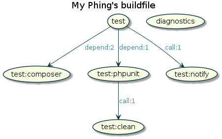

Phing visualizer
================

**Phing visualizer** generates a graphical representation of your 
[Phing](https://www.phing.info/)'s buildfile.

>💡 Important: `phing-visualizer` has been ported to Phing as `VisualizerTask`.  
>You can use `<visualizer/>` since [Phing 3.0.0-alpha3][].

[](https://packagist.org/packages/jawira/phing-visualizer)
[](https://www.travis-ci.org/jawira/phing-visualizer)
[](https://packagist.org/packages/jawira/phing-visualizer)
[](https://codeclimate.com/github/jawira/phing-visualizer/maintainability)
[](https://codeclimate.com/github/jawira/phing-visualizer/test_coverage)
[](https://packagist.org/packages/jawira/phing-visualizer)
[](https://github.com/php-pds/skeleton)
[](https://packagist.org/packages/jawira/phing-visualizer)
[](https://huboard.com/jawira/phing-visualizer)

With **phing-visualizer** You can go from this:

```xml
<?xml version="1.0" encoding="UTF-8"?>
<project name="My Phing's buildfile" default="test">

    <target name="test" depends="test:phpunit, test:composer">
        <phingcall target="test:notify"/>
    </target>

    <target name="test:composer">
        <composer>
            <arg line="validate --strict --no-check-lock"/>
        </composer>
    </target>

    <target name="test:phpunit">
        <exec executable="${phpunit}"/>
        <phingcall target="test:clean"/>
    </target>

    <target name="test:notify">
        <notifysend msg="Everything is OK!"/>
    </target>

    <target name="test:clean">
        <delete dir="${dir.output}" verbose="true"/>
    </target>

    <target name="diagnostics">
        <diagnostics/>
    </target>

</project>
```

To this:



**Phing visualizer** is able to represent:

- Target's depends
- RunTargetTask
- PhingCallTask
- ForeachTask

Usage
-----

Create your diagram using the command line, some examples:

```console
$ vendor/bin/phing-visualizer
```

```console
$ vendor/bin/phing-visualizer -i build.xml -f svg
```

```console
$ vendor/bin/phing-visualizer --input /my/location/build.xml --format svg
```

```console
$ vendor/bin/phing-visualizer -i /my/location/build.xml -f png  -o /another/location/ 
```

Options
-------

| Option                | Description                                   | Default value     |
| --------------------- | --------------------------------------------- | ----------------- | 
| `-i` or `--input`     | Phing's buildfile location                    | build.xml         |
| `-o` or `--output`    | Dir or file location                          | Same as `--input` |
| `-f` or `--format`    | Diagram format (`png`, `svg`, `eps` or `puml`)| `png`             |
| `-h` or `--help`      | Help                                          |                   |

Installing
----------

```console
$ composer require jawira/phing-visualizer
```

Requirements
------------

- SimpleXML extension
- XSL extension
- `allow_url_fopen = On;` (on `php.ini` file)

More examples
-------------

[](https://gist.github.com/leric/1216551)

[](https://gist.github.com/melin/fa4818acc9fd55666b77)

[](https://gist.github.com/bobbravo2/0fb3eef82c9c5be60415df61c01e8fd4)

[](https://github.com/bitpay/magento2-plugin/blob/master/build.xml)

Contributing
------------

If you liked this project, ⭐ star it on [GitHub].

License
-------

This project is under the [GNU GPLv3 license](./LICENSE).

***

Packages from jawira
--------------------

<dl>

<dt><a href="https://packagist.org/packages/jawira/phing-visualizer-gui">jawira/phing-visualizer-gui</a> (library)</dt>
<dd>GUI for jawira/phing-visualizer.</dd>

<dt><a href="https://packagist.org/packages/jawira/phing-open-task">jawira/phing-open-task</a> (library)</dt>
<dd>Phing task to open files, directories, and URLs with your favorite software.</dd>

<dt><a href="https://packagist.org/packages/jawira/process-maker">jawira/process-maker</a> (project)</dt>
<dd>Easily install and try ProcessMaker using Docker Compose.</dd>

<dt><a href="https://packagist.org/packages/jawira/">more...</a></dt>

</dl>


[GitHub]: https://github.com/jawira/phing-visualizer
[Phing 3.0.0-alpha3]: https://github.com/phingofficial/phing/releases/tag/3.0.0-alpha3
